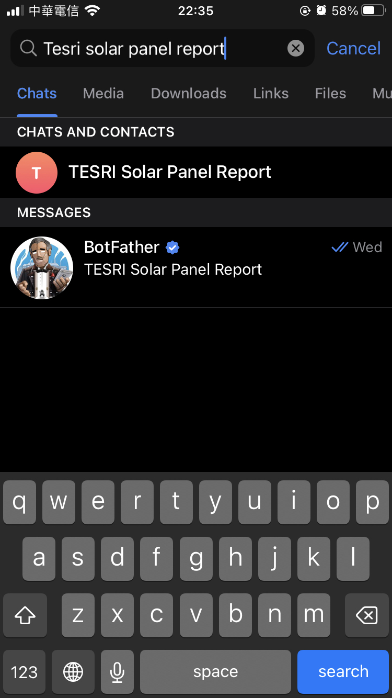
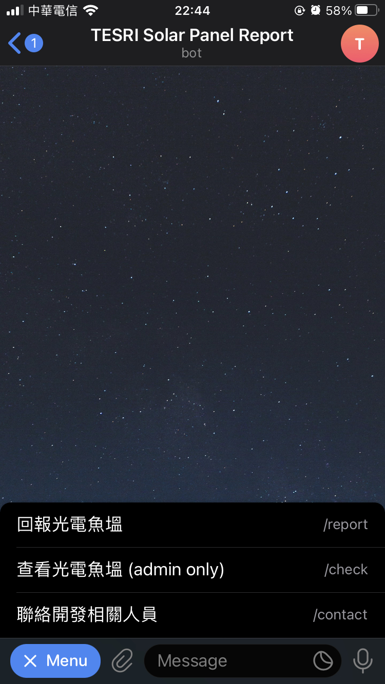
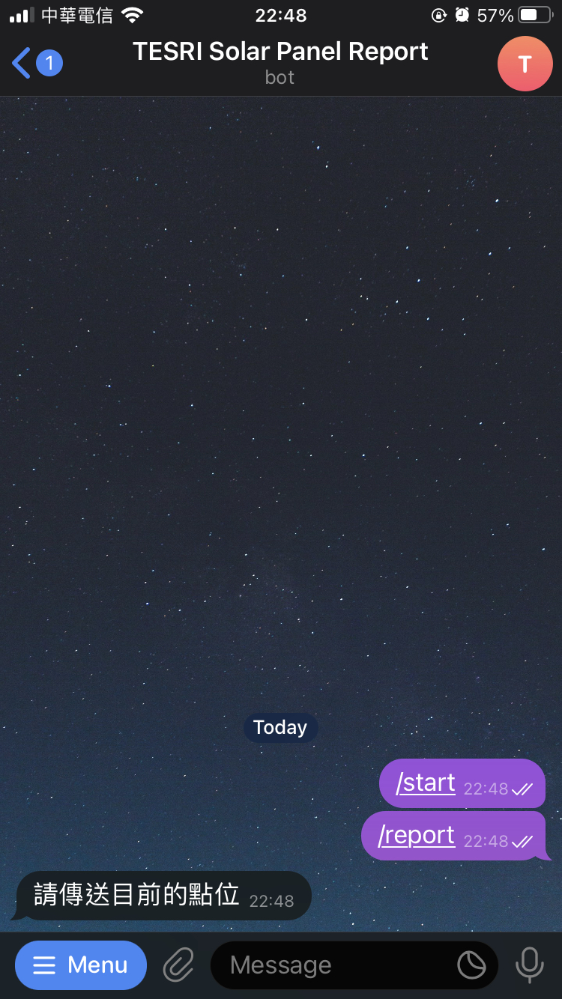
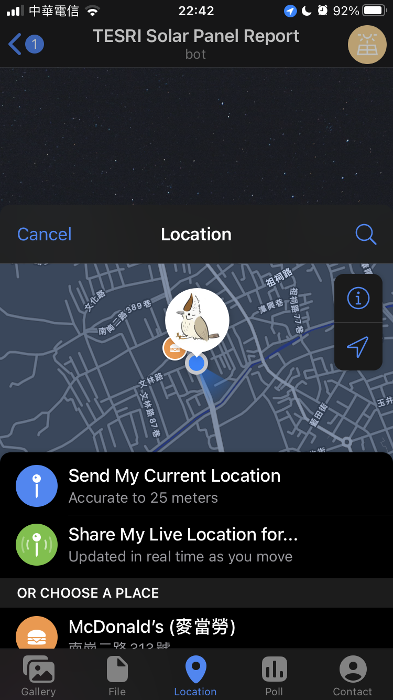
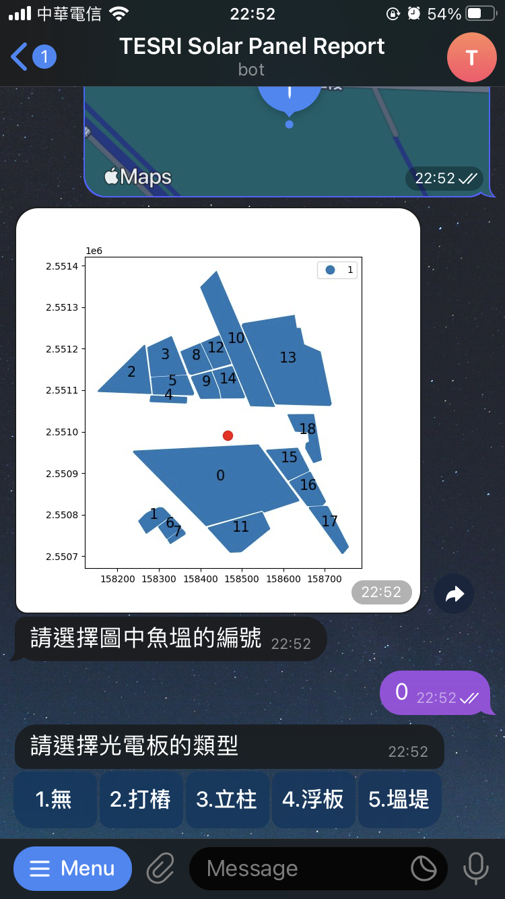
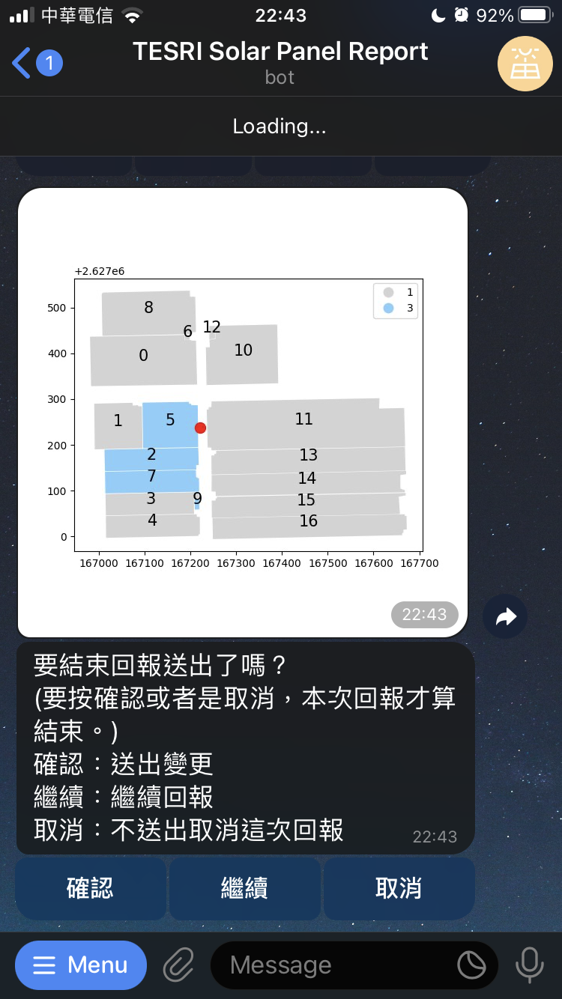
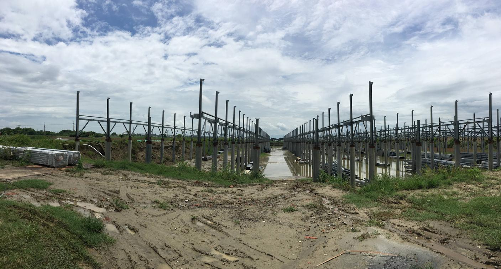
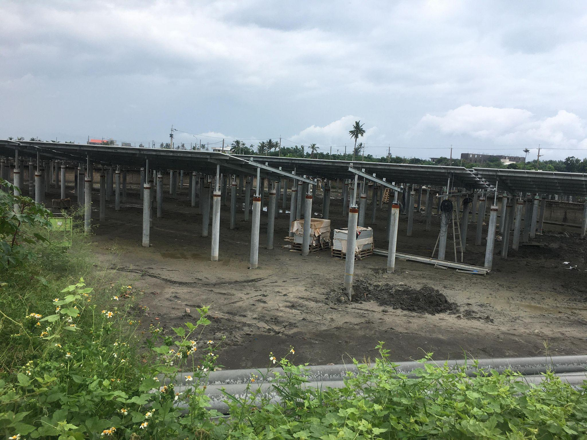
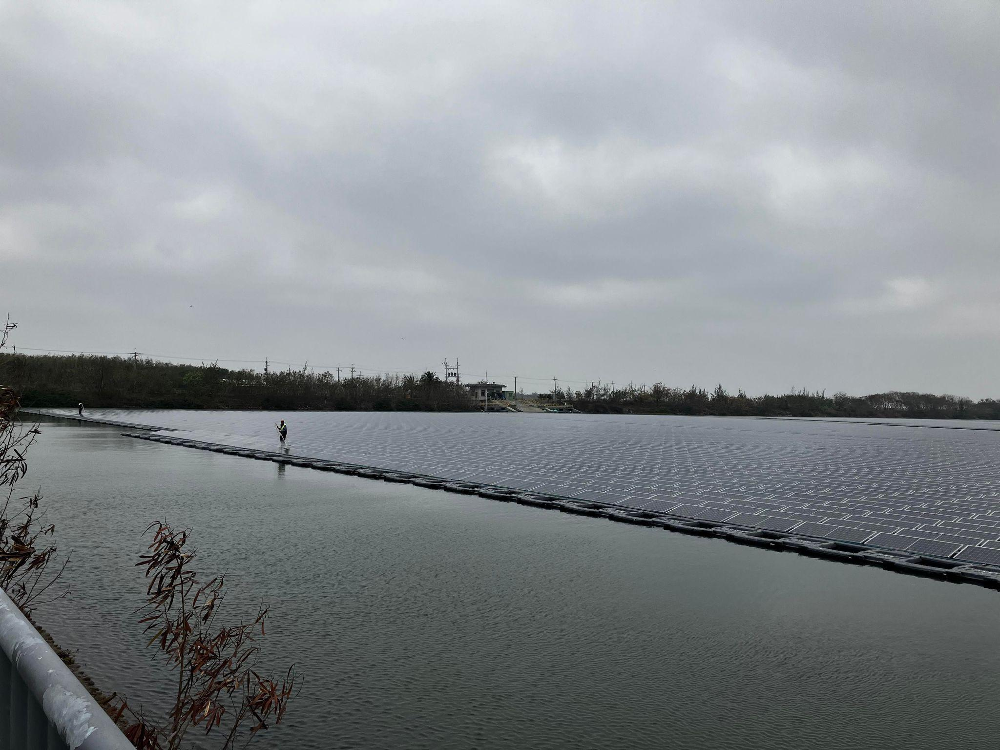

# 魚塭太陽能板回報系統使用說明

## 指令列表
`/report` - 開始回報光電魚塭

`/check` - 查看魚塭光電

`/type` - 光電板類型說明

`/manual` - 使用手冊

`/contact` - 聯絡相關人員

## 搜尋 Telegram Bot 帳號
在 Telegram 上搜尋 “TESRI Solar Panel Report” 。

或者是直接透過連結找到機器人帳號：[t.me/tesri_solar_bot](https://t.me/tesri_solar_bot)。

## 回報方式

### 1. 輸入指令
請先輸入 `/report` ，或點選左下角的 menu 選單，點選 `/report` 指令。

### 2. 傳送點位
傳送你目前的點位，你也可以移動地圖，選擇其他點位。

### 3. 輸入魚塭編號
機器人會依照你的回傳點位，回傳點為附近的魚塭，請輸入想要回報的魚塭編號。

### 4. 選擇光電板類型
請依照你觀察到的類別，按光電板按鈕。按下後你可以選擇送出、繼續回報、或者是取消。

## 光電板類型說明
光電板回報類型分成 4 種，分別為：無、打樁、地面型、水面型 (如果是堤岸型的光電板不用回報。)。

你也可以使用 `/type` 指令來查看說明。

1. 無：未設置光電區域，如果填錯了可以用這個選項來返回。

2. 打樁：地面型光電尚僅只有柱子，未裝置光電板。若只有整地不算在此類，至少需要有一根柱子

3. 地面型：已裝置光電板之地面型光電(只要有一塊就算)

4. 水面型：已裝置光電板之水面型光電。

## 聯絡管理員
你可以使用 `/contact` 指令來獲得管理員的聯絡資訊。

